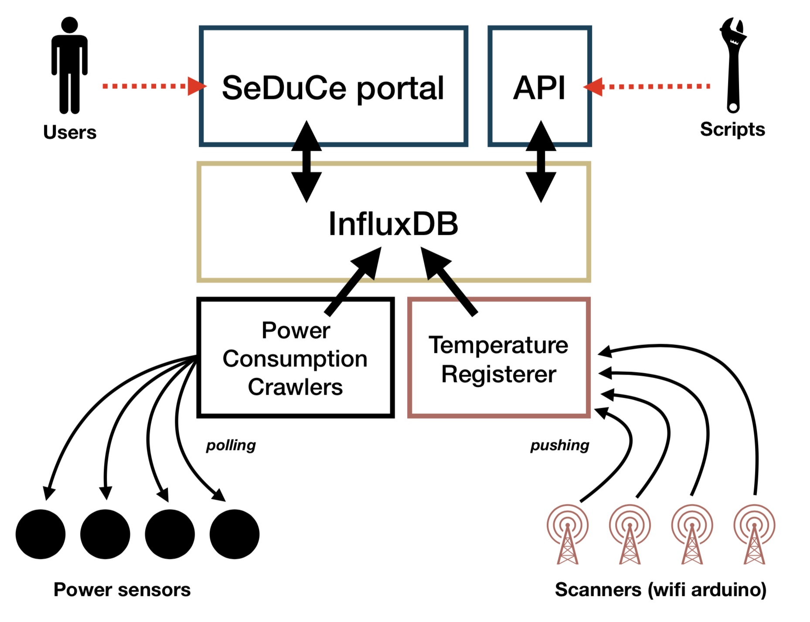

# Architecture

The SeDuCe dashboard is a web application which contains several sub services:

- *frontend*
- *api*
- *influxdb*
- *pdu_crawler_z1_10*
- *pdu_crawler_z1_11*
- *pdu_crawler_z1_20*
- *pdu_crawler_z1_21*
- *pdu_crawler_z1_40*
- *pdu_crawler_z1_41*
- *pdu_crawler_z1_50*
- *pdu_crawler_z1_51*
- *temperature_registerer*
- *sensors_crawler*
- *modbus_crawler_entech*
- *modbus_crawler_inrow*
- *poe_crawler*
- *redis*
- *celery_beat*
- *celery_worker*

All theses services are run through [supervisord](http://supervisord.org/), which read a configuration file in `/etc/supervisord.conf` based on [the example configuration file](https://github.com/SeduceProject/seduceboard/blob/master/conf/seduce/supervisord.conf.example).
The overall architecture of the dashboard follows quite the functional architecture depicted by this Figure:

## SeDuCe portal

The services in charge are:

- *frontend*

This service is in charge of serving a web UI to users of the SeDuCe testbed. It is developed using the python Flask framework and consist of monolithic web applications composed of several [blueprints](https://flask.palletsprojects.com/en/1.1.x/blueprints/).

The executable of this service is located in [bin/app.py](https://github.com/SeduceProject/seduceboard/blob/master/bin/app.py) and the resulting web app is available at [dashboard.seduce.fr](dashboard.seduce.fr/).

## SeDuCe API

The services in charge are:

- *api*

This service is in charge of serving an API to enable users to use the SeDuCe testbed. It is developed using the python Flask framework integrated with the [flasgger](https://github.com/flasgger/flasgger) framework to generate Swagger documentation.

The executable of this service is located in [bin/app.py](https://github.com/SeduceProject/seduceboard/blob/master/bin/api.py) and the resulting web app is available at [api.seduce.fr](api.seduce.fr/).

## InfluxDB

The services in charge are:

- *influxdb*

All the data regarding metrics collected in the SeDuCe system are stored in an InfluxDB database.
 
The following rules have been used to integrate SeDuCe with influx:

- each sensors stores its related values in the `sensors` serie, with a tag corresponding to its name. For example, values of sensors `ecotype-1_pdu-Z1.50` is stored in the following location: `sensors,location=ecotype-1,sensor=ecotype-1_pdu-Z1.50,sensor_type=wattmeter,unit=W`, which corresponds to:  
    - serie: `sensors`
    - tags: `location=ecotype-1,sensor=ecotype-1_pdu-Z1.50,sensor_type=wattmeter,unit=W`
- data from `sensors` are aggregated every 30s, 1m, 1h, 1d in series called
    - `measurement_downsample_1m,sensor=ecotype-1_pdu-Z1.50`
    - `measurement_downsample_1h,sensor=ecotype-1_pdu-Z1.50`
    - `measurement_downsample_1d,sensor=ecotype-1_pdu-Z1.50`
- to ease the development of tree visualisation, data from power consumption and power production sensors are aggreagated by continuous queries in:
    - `cq_battery1_30s`
    - `cq_battery1_1m`
    - `cq_battery1_1h`
    - `cq_battery1_1d`

## Power consumption crawlers

The services in charge are:

- *pdu_crawler_z1_10*
- *pdu_crawler_z1_11*
- *pdu_crawler_z1_20*
- *pdu_crawler_z1_21*
- *pdu_crawler_z1_40*
- *pdu_crawler_z1_41*
- *pdu_crawler_z1_50*
- *pdu_crawler_z1_51*
- *poe_crawler*
- *modbus_crawler_inrow*

These services are based on implementations located in:

- [bin/snmp crawler.py](https://github.com/SeduceProject/seduceboard/blob/master/bin/snmp_crawler.py)
- [bin/modbus crawler.py](https://github.com/SeduceProject/seduceboard/blob/master/bin/modbus_crawler.py)

## Temperature Registerer

The services in charge are:

- *temperature_registerer*

The `temperature_registerer` is a Flask web application that receives HTTP requests from arduino cards connected to temperature sensors.
The implementation of the `temperature_registerer` is based on [bin/temperature_registerer.py](https://github.com/SeduceProject/seduceboard/blob/master/bin/temperature_registerer.py)

## Entech crawler

The service in charge of collecting metrics from Entech's control board is called:

- *modbus_crawler_entech*

The implementation is based on [bin/modbus crawler.py](https://github.com/SeduceProject/seduceboard/blob/master/bin/modbus_crawler.py).

## Periodic tasks system

The periodic tasks system uses the following services:

- *redis*
- *celery_beat*
- *celery_worker*

The periodic task system leverages [celery](https://docs.celeryproject.org/en/stable/) in the following way:

- `redis` is used as a storage system for the inner state of celery, and as a publish/subscribe system
- `celery_beat` triggers periodically functions that should be executed by workers
- `celery_worker` reacts to events triggered by `celery_beat` and executes some functions.

In SeDuCe, we have the following periodic tasks defined in [bin/celery_tasks.py](https://github.com/SeduceProject/seduceboard/blob/master/bin/celery_tasks.py):

- `send_confirmation_email`: checks if a user needs to receive an email that would enable him to confirm his email account.
- `send_authorization_email`: checks if a user has confirmed its email by clicking the link contained in the email sent by the `send_confirmation_email` task.
- `detect_unresponsive_temperature_sensors`: checks how long a sensor has been unresponsive, and if it is over a threshold, it increases an error counter associated to the sensor and stored on redis. 
- `run_job`: checks if continuous query recomputation job is waiting to be executed (`created` or `waiting` states). It prepares the parameters (time interval) for the next execution and mark the job as waiting for its execution.
- `wait_job`: checks if continuous query recomputation job should be running (`running` state). It runs the query with the parameters (time interval) decided by `run_job`.
- `finish_job`: checks if continuous query recomputation job is waiting (`waiting` state) and checks if all the time interval has been processed. If this is the case, it marks the jobs as finished.

## Database

The SeDuCe platform uses a relational database to store some of its states. The database is used with the 
ORM [SQLAlchemy](https://www.sqlalchemy.org/), and we currently uses [sqlite](https://www.sqlite.org) as database 
backend.

The database contains two types of objets which both act as [finite state machines](https://en.wikipedia.org/wiki/Finite-state_machine):

- `User`: [states](https://github.com/SeduceProject/seduceboard/blob/master/core/finite_state_machine/fsm.py#L4) transitions:[here](https://github.com/SeduceProject/seduceboard/blob/master/core/finite_state_machine/fsm.py#L8) implementation:[here](https://github.com/SeduceProject/seduceboard/blob/master/tasks/email.py)
- `ContinuousQueryRecomputeJob`: [states](https://github.com/SeduceProject/seduceboard/blob/master/core/finite_state_machine/fsm.py#L20) transitions:[here](https://github.com/SeduceProject/seduceboard/blob/master/core/finite_state_machine/fsm.py#L23) implementation:[here](https://github.com/SeduceProject/seduceboard/blob/master/tasks/cq_jobs.py)

