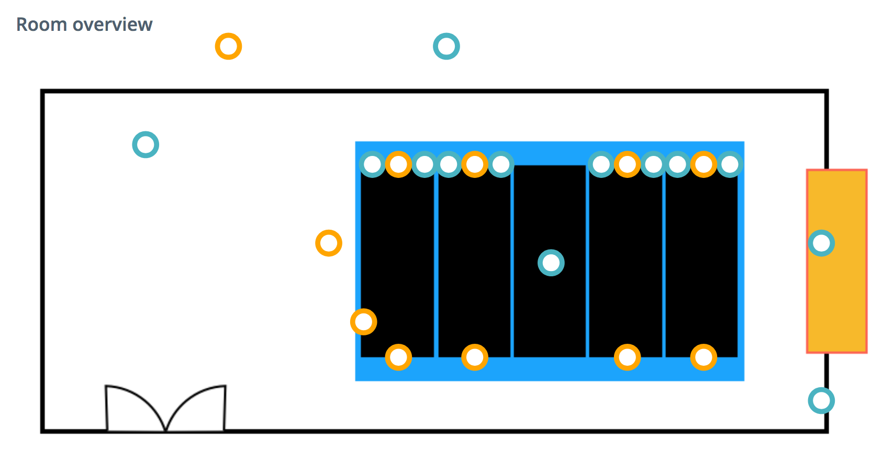

# Configuration

## conf/sensors.yaml

This file contains all:

- classes of sensors
- sensors trees
- sensors

classes of sensor are defined as follow:

```yaml
classes:

  wattmeter: &wattmeter
    sensor_type: wattmeter
    unit: W

  watt_cooler_b232: &watt_cooler_b232
    <<: *wattmeter
    method: flukso
    ip: 192.168.1.48
    port: 8080
    location: B232
    parent: watt_cooler_b232
```

in the previous snippet, we define two classes of sensors : the first one is `wattmeter` which
define general properties for sensors classes, and a second class `watt_cooler_b232` which inherits
`wattmeter` and defines properties of sensors related to cooler in b232 room.

and a sensor is defined as follow:

```yaml
flukso:
  watt_cooler_b232_1:
    info: Flukso B232 (clamp1)
    name: watt_cooler_b232_1
    sensor_id: c6a2caade50d7532ee3a3292238fd587
    <<: *watt_cooler_b232
```

in the previous snippet, we define a sensor tree `flukso`,
which contains a single sensor `watt_cooler_b232_1`

## conf/racks.yaml

This file describe the racks monitored by the SeDuCe infrastructure. It contains data defined as follow:

```yaml
name: ecotype
racks:
  Z1.1:
    ecotype-37:
      position: 32
      type: compute
    ecotype-38:
      position: 30
      type: compute
site: nantes.grid5000.fr
```

in the previous snippet, we define that the racks belong to a cluster named `ecotype`,
located in domain name `nantes.grid5000.fr` and which contains at least one rack named `Z1.1`
that have 2 elements `ecotype-37` and `ecotype-38`.

For each element, we define its position in the racks (1 in in the bottom and 42 is in the top), and the type of the element.
The type of an element can be `compute` for computer servers, or `switch` for network switches.

## conf/room_map.yaml

This configuration file is used to generate the following image:



Each colored circle of the map is defined as follow:

```yaml
pdu-Z1.10:
  coordinates:
    x: 82.5%
    y: 25%
  info: PDU (pdu-Z1.10) of rack z1.10
  location: B232
  name: pdu-Z1.10
  color: blue
  sensors:
  - ecotype-37_pdu-Z1.10
  - ecotype-38_pdu-Z1.10
  - ecotype-39_pdu-Z1.10
  - ecotype-40_pdu-Z1.10
  - ecotype-41_pdu-Z1.10
  - ecotype-42_pdu-Z1.10
  - ecotype-43_pdu-Z1.10
  - ecotype-44_pdu-Z1.10
  - ecotype-45_pdu-Z1.10
  - ecotype-46_pdu-Z1.10
  - ecotype-47_pdu-Z1.10
  - ecotype-48_pdu-Z1.10
```

In the previous snippet, we defined a sensor tree called `pdu-Z1.10`, which is located at the coordinate (82.5%, 25%)
relatively to the top left corner of the map. The color of the circle is defined with the `color` property.

With the `sensors` property we define the list of sensors associated to the sensor tree. This list corresponds to the list
that appears on the right of the map when the colored circles is clicked:


## conf/temperature.yaml

In this configuration file we define the layout of temperature sensors of the SeDuCe infrastructure. The data follows this format:

```yaml
room:
  top:
    '1':
      serie: 28b8fb2909000003
      tags:
      - external-temperature
```

In the previous snippet we defined an overall position `room`, which can contains several sides. In this case we define 
a side `top` as the temperature sensor of the server room is located in the top. For temperature sensors in racks, we 
generally encounter two sides `front` and `back` which respectively correspond to the cold aisle and the hot aisle of
 racks. 
 
In the previous snippet `'1'` corresponds to the position in racks (please note that it is defined as a string because the yaml files are the result of a previous migration process, it could be moved to a int type with few modifications to the implementation of the dashboard),
we associate this position with a sensor defined in `conf/sensors.yaml` and can provide optional tags to the sensor.

This file is used to generate this visualisation:


## conf/multitree.yaml

This file define how the power consumptions measured by wattmeters can be aggregated to understand their contribution to the overall power consumption of the server room.
Its data follows the following format:

```yaml
datacenter:
  children:
  - servers
  - cooling
  id: datacenter
  name: Datacenter
  root: true

servers:
  children:
  - ecotype1
  - ecotype2
  id: servers
  name: Servers

ecotype_1:
  children:
  - ecotype_1_Z1_51
  - ecotype_1_Z1_50
  id: ecotype_1
  name: ecotype-1
ecotype_1_Z1_50:
  id: ecotype_1_Z1_50
  name: ecotype-1-Z1.50
  target: ecotype-1_pdu-Z1.50
ecotype_1_Z1_51:
  id: ecotype_1_Z1_51
  name: ecotype-1-Z1.51
  target: ecotype-1_pdu-Z1.51

ecotype_2:
  children:
  - ecotype_2_Z1_51
  - ecotype_2_Z1_50
  id: ecotype_2
  name: ecotype-2
ecotype_2_Z1_50:
  id: ecotype_2_Z1_50
  name: ecotype-2-Z1.50
  target: ecotype-2_pdu-Z1.50
ecotype_2_Z1_51:
  id: ecotype_2_Z1_51
  name: ecotype-2-Z1.51
  target: ecotype-2_pdu-Z1.51
```

In the previous snippet we define a simplified view of the datacenter : it contains 
two servers `ecotype_1` and `ecotype_2` which each have two metered electrical plugs
`ecotype_1_Z1_51`, `ecotype_1_Z1_50`, `ecotype_2_Z1_51`, `ecotype_2_Z1_50`. The consumption
of each servers aggregates the consumption to each of its plugs, and the consumption of the
the servers are aggregated in the `servers` node, and the datacenter node aggregates 
the consumption of the `servers` node and the `cooling` node (which is not explicetely
defined for the sake of the example).

Each node definition follows this format:

- a yaml key (`datacenter`, `servers`, ...) defines a node block
- an `id` property which is used to reference the block in other blocks
- a `name` property defines the label that will be displayed on visualisation
- if the node is not a leaf, a `children` property defines the ids of the children nodes
- if the node is a leaf, a `target` property defines the sensor corresponding to the node 

A node definition results in the creation of several influxdb continuous queries, each node having its own set of continuous queries:

cq_datacenter_30s:

```
CREATE CONTINUOUS QUERY cq_datacenter_30s ON pidiou BEGIN SELECT sum(mean) AS value INTO pidiou.autogen.cq_datacenter_30s FROM (SELECT mean(value) FROM pidiou.autogen.sensors WHERE (sensor = 'cooling' OR sensor = 'ecotype-1_pdu-Z1.51' OR sensor = 'ecotype-1_pdu-Z1.50' OR sensor = 'ecotype-2_pdu-Z1.50' OR sensor = 'ecotype-2_pdu-Z1.51') GROUP BY time(30s), sensor) GROUP BY time(30s) END
```

cq_datacenter_1m:

```
CREATE CONTINUOUS QUERY cq_datacenter_1m ON pidiou BEGIN SELECT sum(value), mean(value), stddev(value), count(value), median(value), min(value), max(value) INTO pidiou.autogen.cq_datacenter_1m FROM pidiou.autogen.cq_datacenter_30s GROUP BY time(1m), sensor_type END
```


cq_datacenter_1m:

```
CREATE CONTINUOUS QUERY cq_datacenter_1m ON pidiou BEGIN SELECT sum(value), mean(value), stddev(value), count(value), median(value), min(value), max(value) INTO pidiou.autogen.cq_datacenter_1m FROM pidiou.autogen.cq_datacenter_30s GROUP BY time(1m), sensor_type END
```

cq_datacenter_1h:
 
```
CREATE CONTINUOUS QUERY cq_datacenter_1h ON pidiou BEGIN SELECT sum(value), mean(value), stddev(value), count(value), median(value), min(value), max(value) INTO pidiou.autogen.cq_datacenter_1h FROM pidiou.autogen.cq_datacenter_30s GROUP BY time(1h), sensor_type END
```

cq_datacenter_1d:

```
CREATE CONTINUOUS QUERY cq_datacenter_1d ON pidiou BEGIN SELECT sum(value), mean(value), stddev(value), count(value), median(value), min(value), max(value) INTO pidiou.autogen.cq_datacenter_1d FROM pidiou.autogen.cq_datacenter_30s GROUP BY time(1d), sensor_type END
```

We can notice that the `_30s` queries use all sensors of subnodes.


This file is used to generate this visualisation:


## conf/production.yaml

The functionning of this file is similar to `conf/multitree.yaml`.

It is used to generate this visualisation:


## conf/commands.yaml

This file contains the definitions of commands used to manage parts of the SeDuCe testbed, including the electrical
network installed by Entech.

This file contains all:

- classes of values (integer 16bits, unsigned integer 16bits, ...) and their endian-ness
- commands
- properties

First we define type of values and their endian-ness:

```yaml
classes:

  # Entech's sensor bus
  modbus_entech: &modbus_entech
    method: modbus
    ip: 192.168.1.2
    port: 503
    parent: modbus_entech
    location: "outside"

  # Modbus types
  big_endian_int16: &big_endian_int16
    byteorder: '>' # Big endian
    wordorder: '>' # Big endian
    type: int16
    protocol: modbus
```

and then we define commands as follow:

```yaml
overall_production:
  actions:
    activate:
      how:
        <<: [*modbus_entech, *little_endian_bool]
        action: write
        register: 3000
        value: 1
    deactivate:
      how:
        <<: [*modbus_entech, *little_endian_bool]
        action: write
        register: 3000
        value: 0
    toggle_ack:
      how:
        <<: [*modbus_entech, *little_endian_bool]
        action: write
        register: 3001
        value: 1
  properties:
    status:
      how:
        <<: [*modbus_entech, *big_endian_bool]
        action: read
        register: 3000
        values:
          active:
            expected_value: 1
          inactive:
            expected_value: 0
    grafcet:
      how:
        <<: [*modbus_entech, *big_endian_int16]
        action: read
        register: 1000
```

In the previous snippet, we define commands and properties related to the management of the overall production of solar panels.
We define 3 actions `activate`, `deactivate` and `toggle_ack`. Each action defines a property `how` which explains
how the action should be accomplished. For example, the action `activate` is done by writting
a little endian boolean value `1` to the 3000 register of the modbus card provided by Entech.

We can also define properties : in the previous example we define two properties `status` and `graphcet`.
For example, the action `status` is done by reading a big endian boolean value in the 3000 register of the modbus card provided by Entech.
If the read value is equals to 1, then the displayed status will be `active`, and if the read value
is equal to 0, the displayed value will be `inactive`.


This configuration file is used to generate this page:


