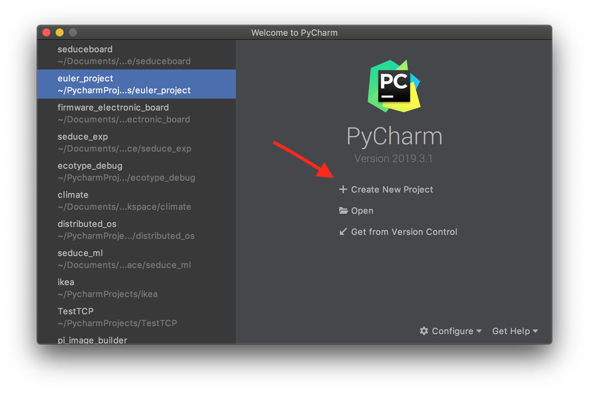
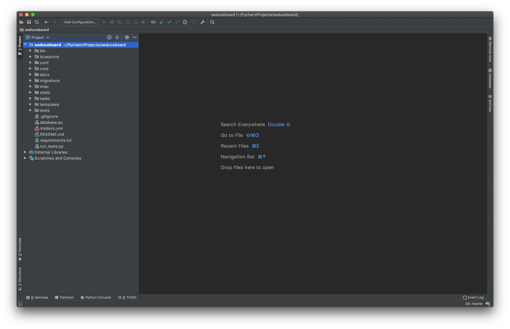
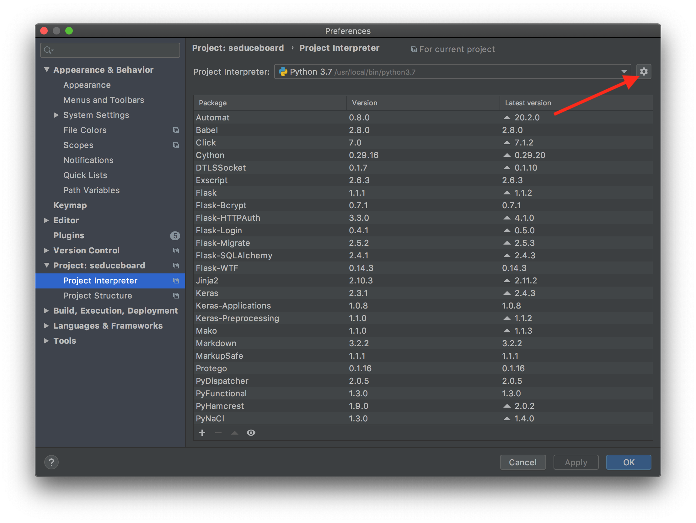
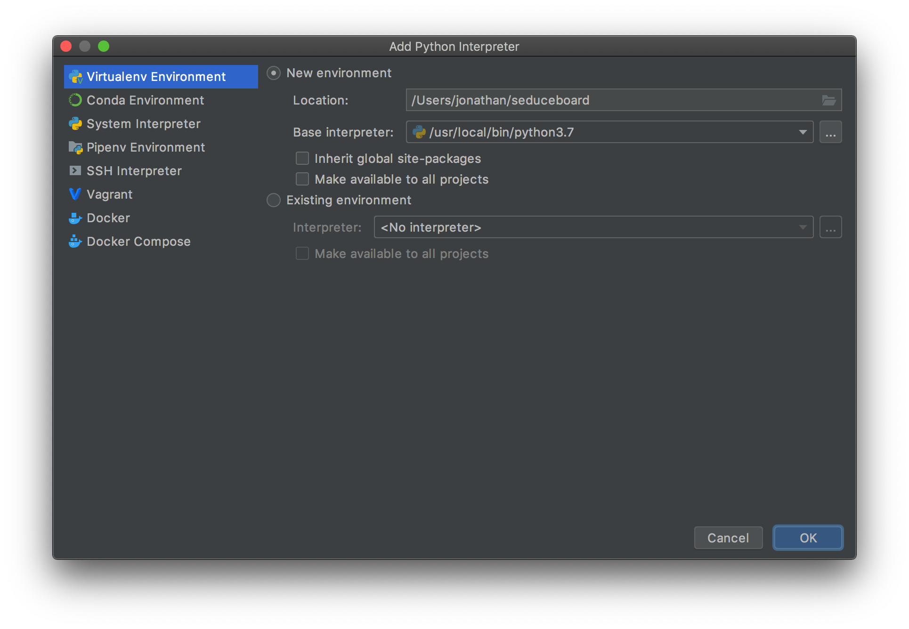
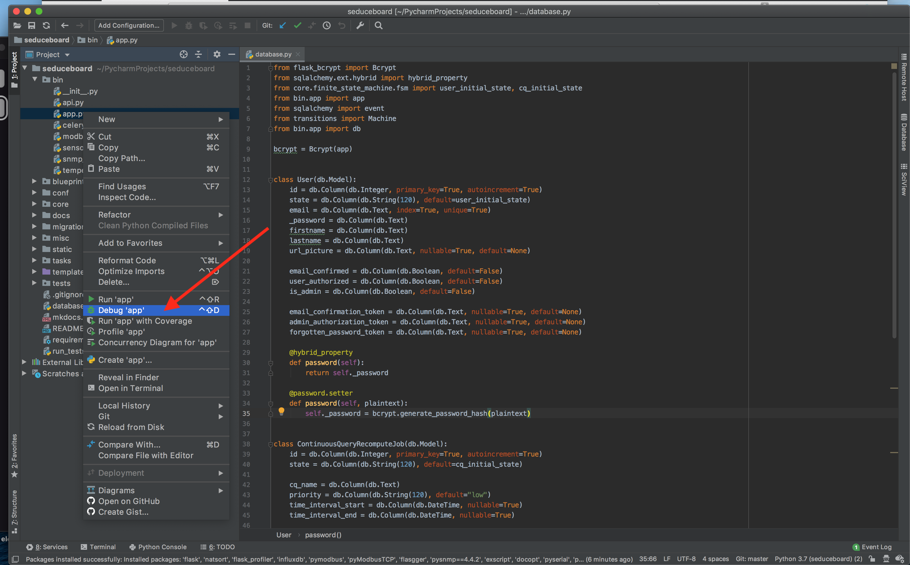
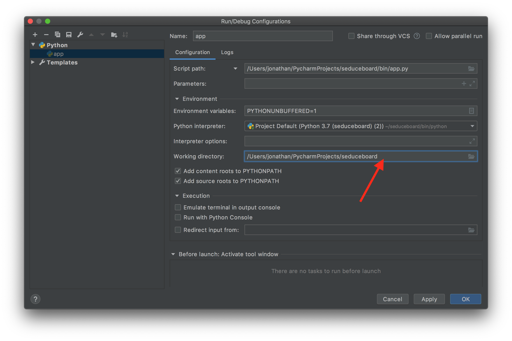
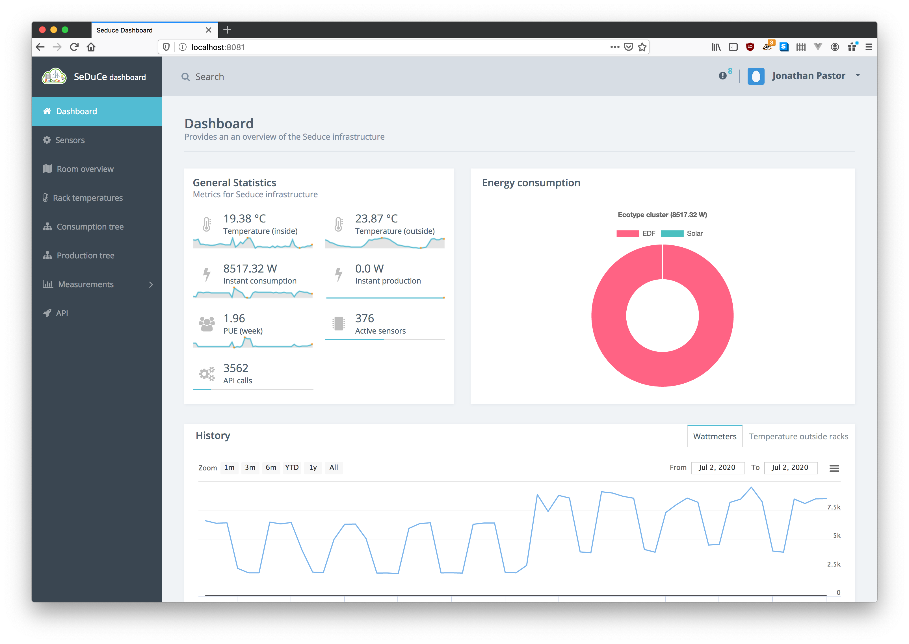

# Development

The SeDuCe platform is mostly developed using the Python3 language, thus a development tool of choice is [PyCharm](https://www.jetbrains.com/fr-fr/pycharm/).
There is a community edition of Pycharm which is free, however you can get a free licence of PyCharm ultimate if you are a member of IMT Atlantique via the [educational licences](https://www.jetbrains.com/fr-fr/community/education/#students).

## Setup the development environment

First, install PyCharm and clone the [seduceboard](https://github.com/SeduceProject/seduceboard) project.
Ensure that you can connect to the `seduce1` server.

Grab the last version of the database via this command:

```shell
scp seduce1:seduceboard/test.db .  
```

and open a tunnel to influxDB: 
```shell
ssh -N -L 8086:192.168.1.25:8086 seduce1
```

In PyCharm open the seduceboard project as follow:


Once the project is loaded (and the indexation finished), go to the project preferences and then `Project Interpreter`:


Click on the `gear` icon on the top right corner to view options to create new python interpreter:


Select `Virtualenv Environment` and create a virtual environment (avoid to place in the project folder):


Right click on `bin/app.py` and select `Debug app`:


Ensure that the `working directory` corresponds to the path of the project (i.e. remove `bin/`):


Launch the script, and you should be able to access the dashboard on port 8081:
