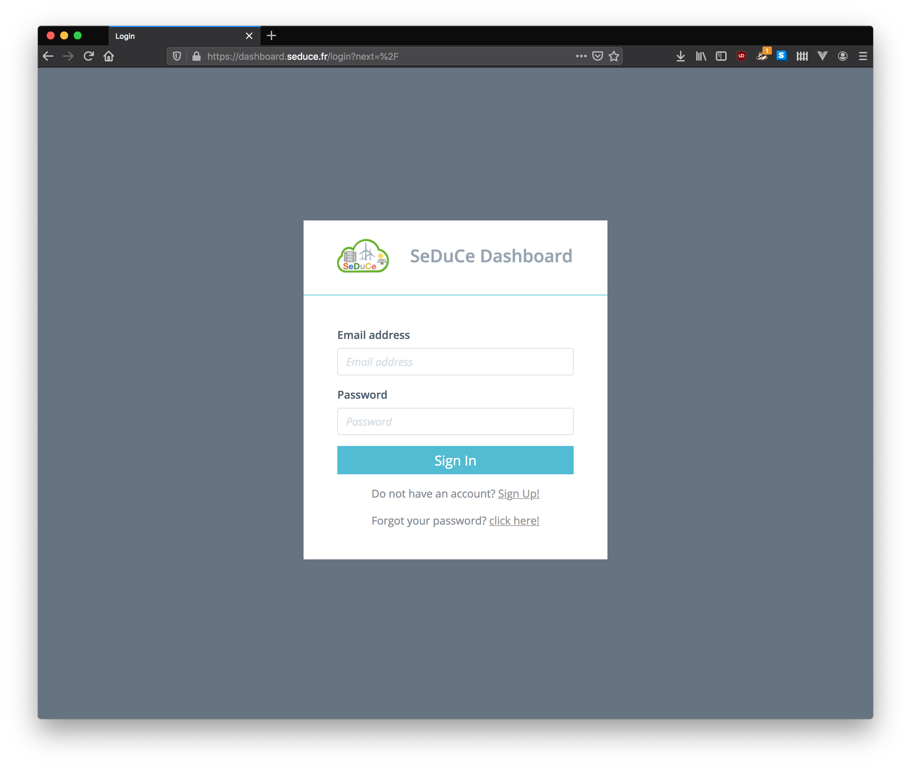
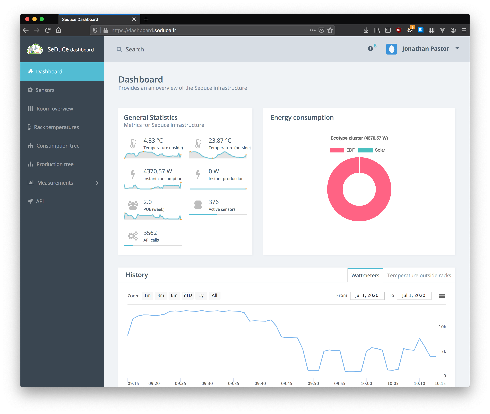

# Overview

The SeDuCe dashboard is the web application that powers the SeDuCe platform. In this document each aspects of the dashboard is detailed:

- [Architecture](/architecture)
- [Configuration](/configuration)
- [Deployment](/deployment)
- [Development](/development)

When deployed, the dashboard results in the following screenshots:

